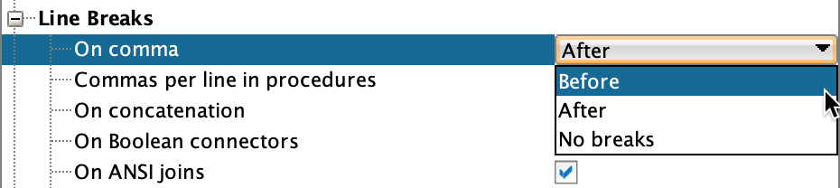
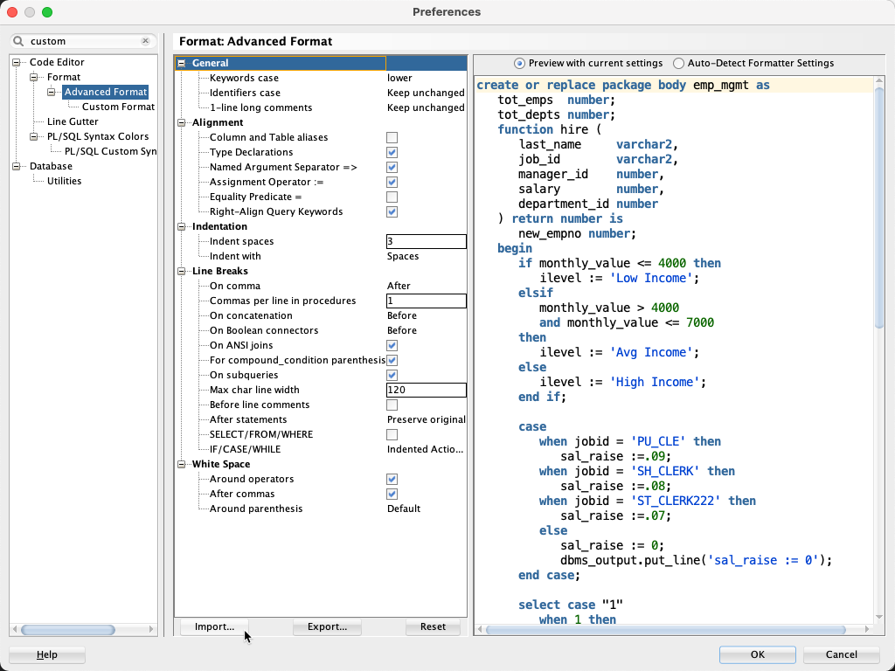
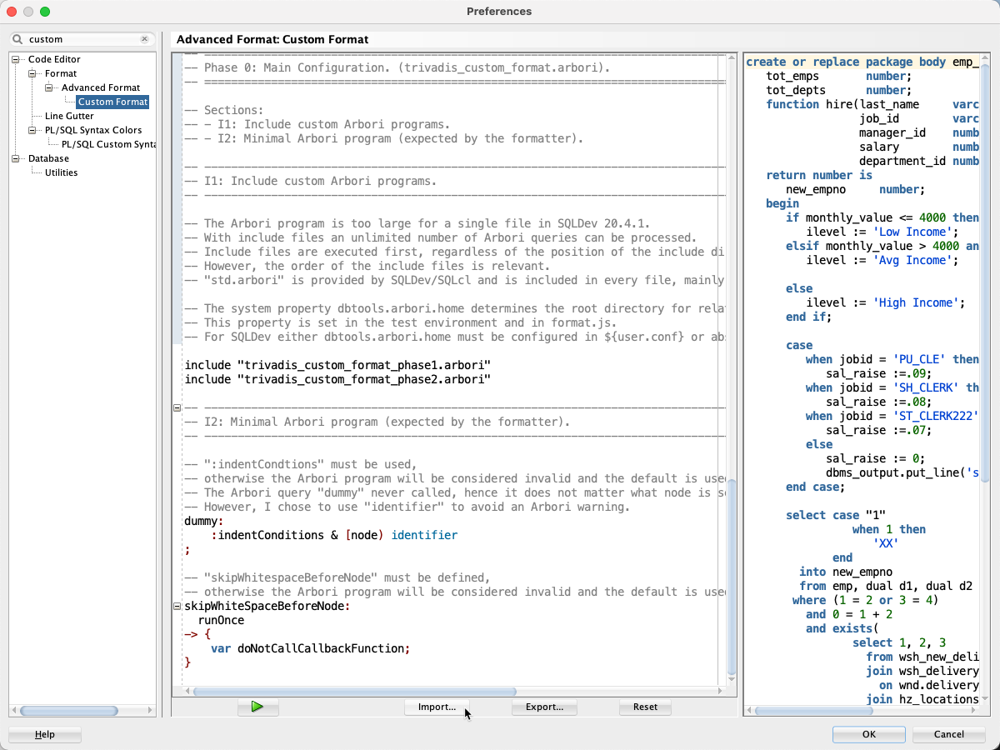

# PL/SQL & SQL Formatter Settings

## Introduction

This repository provides formatter settings for the [coding style rules](https://trivadis.github.io/plsql-and-sql-coding-guidelines/v4.0/3-coding-style/coding-style/#rules) of the Trivadis PL/SQL & SQL Coding Guidelines.

Settings are primarily provided for

- [Oracle SQLcl, Version 21.3.0](https://www.oracle.com/tools/downloads/sqlcl-downloads.html)
- [Oracle SQL Developer, Version 21.2.1](https://www.oracle.com/tools/downloads/sqldev-downloads.html)

These settings have been defined and tested with the product versions mentioned above. They might not work in other versions.

See [releases](https://github.com/Trivadis/plsql-formatter-settings/releases) for settings supporting older versions.

## Deviating Settings

Please note that these settings do not comply with rule 5. Line breaks are placed after a comma and not before. All other rules are followed. However, you can easily change this in the preferences.



## Installation

### Common

Clone this repository or download the ZIP file and extract it. 

### SQLcl

See [sqlcl/README.md](sqlcl/README.md).

### SQL Developer

1. Start SQL Developer
2. Open `Preferences`
3. Select `Code Editor` -> `Format` -> `Advanced Format`
4. Press `Import...`
   
5. Select [`trivadis_advanced_format.xml`](settings/sql_developer/trivadis_advanced_format.xml)
6. Press `Open`
7. Select `Code Editor` -> `Format` -> `Advanced Format` -> `Custom Format`
8. Press `Import...`
   
9. Select [`trivadis_custom_format.arbori`](settings/sql_developer/trivadis_custom_format.arbori)
10. Press `Open`
11. Press `OK` to save the settings

### Git `pre-commit` Hook

See [hook/README.md](hook/README.md).

## Nice to Know

### Lightweight Formatter

The Arbori program implements a [lightweight formatter](https://www.salvis.com/blog/2021/07/18/lightweight-formatter-for-pl-sql-sql/) which accepts different coding styles. If you need a heavyweight formatter to enforce the conformity of your code, you will need to use the default Arbori program provided by the SQL Developer team. 

In any case, you can use our SQLcl JavaScript [`format.js`](sqlcl/README.md), the [standalone formatter](standalone/README.md) or the [Git `pre-commit` hook](hook/README.md) to format your code.

### Disable Formatter

The formatter is enabled by default. You can disable the formatter with a single-line or multi-line comment containing `@formatter:off`. From that point on, whitespace are kept as is. To re-enable the formatter use `@formatter:on`. 

Supported Marker Comment | Action | Origin 
-- | -- | --
`@formatter:off` | Disables formatter | Eclipse IDE
`@formatter:on` | Enables formatter | Eclipse IDE
`noformat start` | Disables formatter | PL/SQL Developer
`noformat end` | Enables formatter | PL/SQL Developer

The marker comments are case sensitive.

Here's an example showing the code after calling the formatter:

```sql
-- @formatter:off
select decode(dummy, 'X', 1 
                   , 'Y', 2
                   , 'Z', 3
                        , 0) /* @formatter:on */
  from dual;
```

### Arbori

SQL Developer uses its own parse tree query language called Arbori for its advanced formatter configuration. Here is some additional information that might be useful if you plan to tweak the behavior of the formatter yourself.

#### Links

- [Formatting Code With SQL Developer](https://www.salvis.com/blog/2020/04/13/formatting-code-with-sql-developer/)
- [Formatter Callback Functions](https://www.salvis.com/blog/2020/11/12/formatter-callback-functions/)
- [SQL Developer 20.4 User Guide, Code Editor: Format](https://docs.oracle.com/en/database/oracle/sql-developer/20.4/rptug/sql-developer-concepts-usage.html#GUID-9421DA6E-A48A-427B-88C9-4414D83EC9D1__GUID-64BE7F6C-37D1-4D21-96A5-E9A19C7D3543)
- [Arbori Starter Manual](https://vadimtropashko.files.wordpress.com/2017/02/arbori-starter-manual.pdf)
- [Semantic Analysis with Arbori](https://vadimtropashko.files.wordpress.com/2019/11/arbori.pdf)
- [Arbori Semantic Actions](https://vadimtropashko.wordpress.com/2019/08/01/arbori-semantic-actions/)
- [Custom Formatting in SQLDev 4.2](https://vadimtropashko.wordpress.com/2017/01/03/custom-formatting-in-sqldev-4-2/)
- [Formula for Formatting](https://vadimtropashko.wordpress.com/2017/09/28/formatting-formulas/) 
- [Custom Syntax Coloring](https://vadimtropashko.wordpress.com/2018/10/10/custom-syntax-coloring/)
- [Arbori 20.2](https://vadimtropashko.wordpress.com/2020/06/19/arbori-20-2/)
- [Java Script Conditions](https://vadimtropashko.wordpress.com/2020/05/29/java-script-conditions/)

Thank you, Vadim Tropashko for providing this valuable information.

#### JavaScript Global Variables

To get the most out of the dynamic JavaScript actions from an Arbori program, you should know the following global variables and their corresponding Java class. 

Variable | Type                                             | JAR File
-------- | ------------------------------------------------ | -----------------------
`struct` | oracle.dbtools.app.Format                        | dbtools-common.jar
`target` | oracle.dbtools.parser.Parsed                     | dbtools-common.jar 
`tuple`  | HashMap<String, oracle.dbtools.parser.ParseNode> | dbtools-common.jar
`logger` | oracle.dbtools.util.Logger                       | dbtools-common.jar

### Settings for other Products

Formatter settings are also provided for the following products:

Product | Version | File
------- | ------- | ---------
[Allround Automations PL/SQL Developer](https://www.allroundautomations.com/products/pl-sql-developer/) | 14.0.6 | [trivadis_beautifier.br](settings/plsql_developer/trivadis_beautifier.br)
[JetBrains DataGrip](https://www.jetbrains.com/datagrip/) | 2021.1 | [trivadis.xml](settings/datagrip/trivadis.xml)
[Quest Toad for Oracle](https://www.quest.com/products/toad-for-oracle/) | 14.1 | [trivadis_fmtplus.opt](settings/toad/trivadis_fmtplus.opt)

Please refer to the vendor's documentation for instructions on how to import these settings.

## Issues
Please file your bug reports, enhancement requests, questions and other support requests within [Github's issue tracker](https://help.github.com/articles/about-issues/).

* [Questions](https://github.com/Trivadis/plsql-formatter-settings/issues?q=is%3Aissue+label%3Aquestion)
* [Open enhancements](https://github.com/Trivadis/plsql-formatter-settings/issues?q=is%3Aopen+is%3Aissue+label%3Aenhancement)
* [Open bugs](https://github.com/Trivadis/plsql-formatter-settings/issues?q=is%3Aopen+is%3Aissue+label%3Abug)
* [Submit new issue](https://github.com/Trivadis/plsql-formatter-settings/issues/new)

## How to Contribute

1. Describe your idea by [submitting an issue](https://github.com/Trivadis/plsql-formatter-settings/issues/new)
2. [Fork the PL/SQL & SQL Formatter Settings respository](https://github.com/Trivadis/plsql-formatter-settings/fork)
3. [Create a branch](https://help.github.com/articles/creating-and-deleting-branches-within-your-repository/), commit and publish your changes and enhancements
4. [Create a pull request](https://help.github.com/articles/creating-a-pull-request/)

## License

The Trivadis PL/SQL & SQL Formatter Settings are licensed under the Apache License, Version 2.0. You may obtain a copy of the License at <http://www.apache.org/licenses/LICENSE-2.0>.
